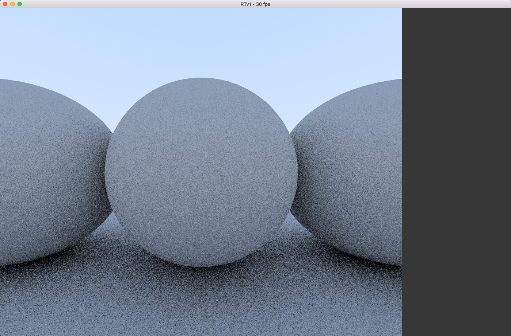
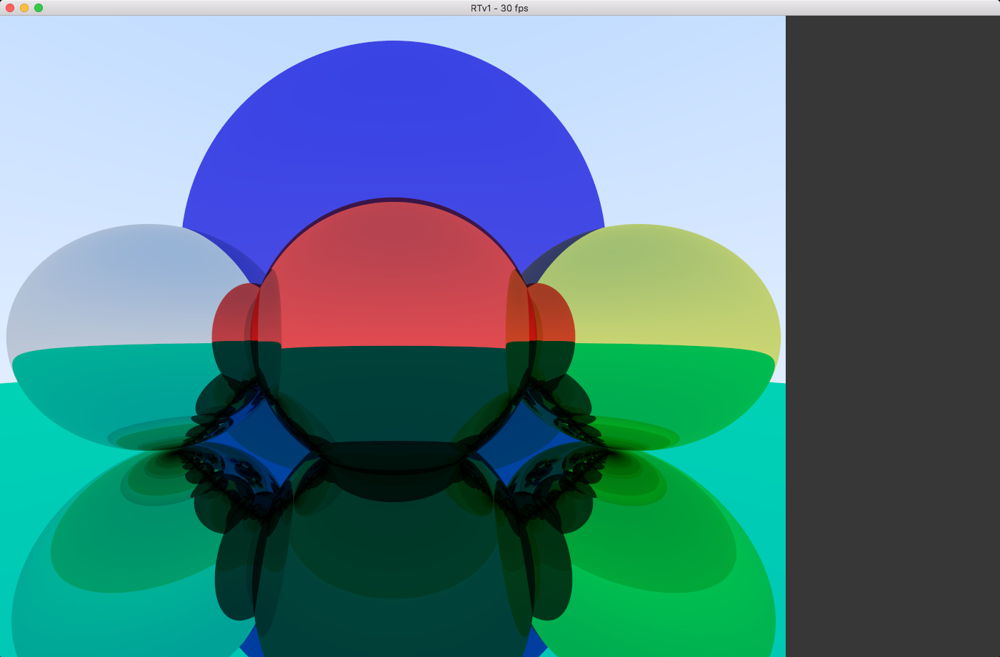

# RTv1
C Raytracer using SDL2 and OpenCL (in developement) :

- SDL only used to manage windows, hook events and draw a pixel on surface;
- Simple objects, only sphere for now; 
- Materials such as Lambert and Metal (with reflections);
- Objects hold in placeholder with function pointers according to type and material;
- Generated "Skybox" (radiant) for background; 
- Multithreading paralelizing raytracing computing by lines (not in available in debugg);
- Open CL to use GPU (planned feature).

#### Lambert and Metal Spheres

#### Infinite Mirror Surface

