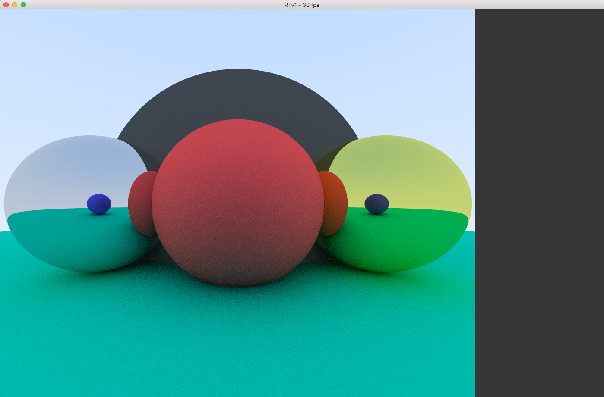

# RTv1
Raytracer in C using SDL2 and OpenCL. Generate a 3D view out of a given scene file. Scene file is just some text from a specific format to specify the rendering.
Rendering is progressiv, you'll need to wait for 25 render passes to get a realistic picture... and up to a 100 to get near to a smooth picture. First render can take 1 or 2 seconds, while a full render may take between 20 and 45 minutes.

- SDL used to manage windows, hook events and draw a pixel on surface;
- Simple objects: sphere, plane, cone (only sphere for now); 
- Materials such as Lambert and Metal (with reflections);
- Objects hold in a placeholder list with function pointers according to type and material;
- Generated "Skybox" (radiant) for background; 
- Anti-aliasing with max depth for reflection materials;
- Parallelize computing to progressively raytrace a more realistic render while user can input events at same time;
- Multithreading to faster compute raytracing - threads work on the same algorithm but on different lines.

### Usage

./RTv1 "file-scene" -options (for now just use ./RTv1)

### Compilation

To compile the project, you can either use Code::Block or the Makefile included directly within. Compilation is supported under Mac OS X, Linux and Windows using MinGW (better to compile with Code::Block).
You will need to install these librairies and headers - make sure the path is okay under Code::Block or in the Makefile:

- [SLD 2](https://www.libsdl.org/download-2.0.php)
- OpenCL 1.2 (depending on your hardware and OS)

For now you can just avoid OpenCL as it is not still used.

MinGW may also need the [pthreads librairy](http://www.mingw.org/wiki/pthreads_library) installed separetly depending on your installation.

The raytracer use a personal libc provided under libft folder. Makefile just do the job as it should, but you need to recompile libft folder separately when using Code::Block.

# In Developement

- Parser for scene files (for now a default scene is provided in a function);
- Options to launch RTv1;
- Light spots and shadows;
- Moveable camera;
- Debugg materials as function pointers;
- Menu on right to control scene and objects;
- Open CL to use GPU.

# Preview
#### What's Behind Camera

#### Light in the Dark

#### Comic Mode

